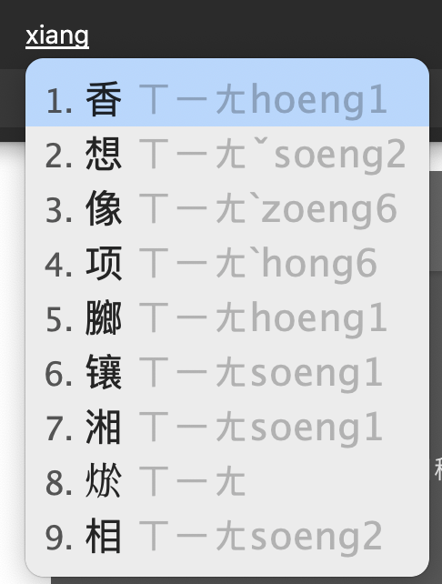
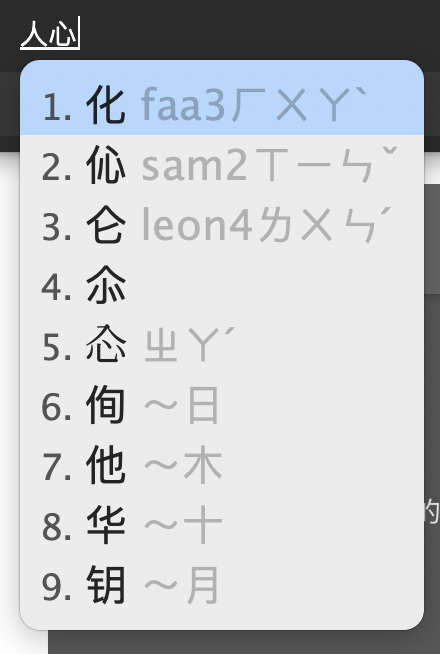
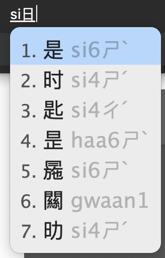

# rime-double-jyutping-extra

## About

This is a layout for typing in a custom Shuangpin (雙拼 / 双拼) layout for Cantonese (粵語 / 粤语 / 廣東話 / 广东话). It will display Mandarin pronunciations as you type in Cantonese. You can type `q` to start looking up by Mandarin pronunciations via the [Flypy Shuangpin (小鹤双拼)](https://github.com/gkovacs/rime-td-pinyin-flypy-extra/blob/master/README.md) method.

## Double Jyutping with Optional Tones (粵語雙拼 / 粤语双拼)


All syllables in Cantonese (粤语 / 广东话) can be entered unambiguously with 2 keystrokes (or 3 for entering tone, ie ending with -p -t -k). The diagram above is described according to the [Jyutping](https://en.wikipedia.org/wiki/Jyutping) (粤拼) standard.

You can optionally enter a tone with 1 additional keystroke - 1 is `;`, 2 is `/`, 3 is `,`, 4 is `x`, 5 is `v`, 6 is `.`. For instance, 师 is `si;` 史 is `si/` 试 is `si,` 时 is `six` 市 is `siv` 是 is `si.`

Syllables ending in -p -t -k (入声) are entered with 3 keys, where the last one is either `r` (for -t), `i` (for -k) or `o` (for -p). For example, "gat" 吉 is `gar`, "faat" 发 is `frr`, "gik" 极 is `gii`, "ngok" 岳 is `aoi`, "goek" 脚 is `gwi`

Null initial (零声母) is `e`. So "on" 安 is `en`, "uk" 屋 is `eui`, "oi" 爱 is `ex`, "aa" 啊 is `er`, "ak" 喔 is `eai`, "am" 暗 is `ea`

For initials which can be followed by either i or ei (d, n, s), -ei gets relocated to the `w` key. So "sei" 四 is `sw`, "si" 师 is `si`. For all other initials (g, f, k, p, b, m, l), -ei remains on the `i` key, so "gui" 攰 is `gw`, "gei" 机 is `gi`.

"ng" 五 is entered by typing `aa`

"m" 唔 is entered by typing `mm`

## Look up Jyutping via Hanyu Pinyin

You can type either `q` to temporarily switch to Putonghua lookup mode, if you don't know the Cantonese pronunciation for a word. In this mode you can enter words using the [Flypy Shuangpin (小鹤双拼)](https://github.com/gkovacs/rime-td-pinyin-flypy-extra/blob/master/README.md) method, and it will display the Jyutping next to the Chinese characters. For example, the Shuangpin for 香 (xiang1) is `xl`. So if you type `qxl` it will show that the Jyutping for 香 is `hoeng1`:




## Look up Jyutping via Cangjie

If you know Cangjie (仓颉输入法), you can look up Jyutping for a character by typing the first letter in capital letters. For example, the Cangjie code for 化 is `op`. So if you type `Op` then it will show you that the Jyutping for 化 is `faa3`:



## Disambiguation via Cangjie

If you know Cangjie (仓颉) or Sucheng (速成), you can enter the first Cangjie character after you enter Jyutping to further narrow down the candidates. For example, both 是 and 事 are `si6` in Jyutping. To disambiguate between them, you can enter `siA` for 是 (the first Cangjie character in 是 is 日 = a, so `siA` = `si日`) or `siJ` for 事 (the first Cangjie character in 事 is 十, so `siJ` = `si十`). You can also add the tone as an additional disambiguation character, so you can also write `si.A` or `siA.` (`si6日`) to make it even more specific that you want to enter `是`.



## Installing

First ensure you have plum installed. For macOS this would be:

```bash
cd ~/Library/Rime
wget https://git.io/rime-install
```

Then install dependencies and `gkovacs/rime-double-jyutping-extra` using plum:

```bash
bash rime-install gkovacs/rime-double-jyutping gkovacs/rime-td-pinyin-flypy gkovacs/rime-double-jyutping-display gkovacs/rime-td-pinyin-flypy-display gkovacs/rime-double-jyutping-extra
```

Finally edit `default.custom.yaml` and add `double_jyutping_extra` to the schema list:

```bash
patch:
  schema_list:
    - schema: double_jyutping_extra
```

Now reload RIME and it should appear under your layouts.

You can also lookup via Cangjie by entering the first letter as capital (e.g. 明 = 日月 = Ab), but you will have to install the following package:

```bash
bash rime-install gkovacs/rime-cangjie-tradsimp
```
